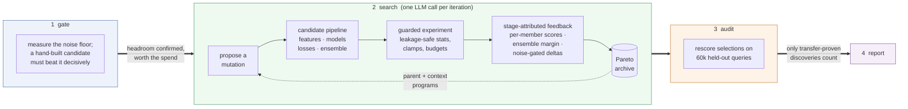

# EvoRank

**An autonomous ranking engineer for Learning-to-Rank.** EvoRank proposes
hypotheses, builds candidate ranking pipelines, runs guarded experiments,
learns from stage-attributed feedback, and keeps only what proves itself on
held-out data. You define the objectives. It does the experimentation.



```
uv run python evorank_cli.py gate      # will this search space pay off? know BEFORE spending
uv run python evorank_cli.py search --seeds 0,1,2 --iterations 50
uv run python evorank_cli.py audit     # only transfer-proven discoveries count
uv run python evorank_cli.py report
```

## What it did on its first real assignment

Pointed at a public e-commerce hotel-search dataset (9.9M impressions, three
competing objectives: relevance, conversion, revenue), three independent
EvoRank seeds each converged in 50 iterations, roughly two hours and ten
dollars of LLM spend, on ranking pipelines that beat an Optuna-tuned
LambdaMART baseline on 60k held-out queries, on every objective at once.
The advantage holds at full data scale under config-equalized comparison:

| trained on 280k queries, tested on 60k | NDCG@10 | NDCG@38 |
|---|---|---|
| LambdaMART, Optuna-tuned at full scale | 0.4544 | 0.5132 |
| EvoRank pipeline, same tuned config | **0.4619** | **0.5185** |

The discovered pipelines are code you can read: within-query rank features,
count encodings, lean feature sets, and a diverse three-member ensemble under
per-query z-score weighting. All three seeds found the same core design
independently, and their own code comments cite the experimental evidence
they learned it from. The programs are in `discovered/`.

## Why it is different: the honesty harness

Autonomous experimentation systems have a failure mode nobody talks about:
under noisy evaluation they select lucky candidates and report steady
progress while discovering nothing real. We measured this happening, on this
codebase, before we fixed it. EvoRank ships with the fix built in:

- **The gate.** Before a single LLM call, `evorank gate` measures your
  fitness noise floor and demands that a hand-built reference candidate beat
  it decisively. If your search space has no headroom, EvoRank tells you to
  keep your money.
- **The audit.** `evorank audit` rescores every selected pipeline on a large
  held-out fold. Selection-fold luck does not survive it. Our own first
  campaign did not survive it either, and that story ships in the paper
  rather than in a drawer.
- **Guarded experiments.** Leakage-safe out-of-fold target encodings (we
  cataloged and measured three generations of encoding leakage so you do not
  have to), whitelisted model and loss families, parameter clamps, wall
  budgets, and rejection messages written so the model learns from them.

## How the loop works

One LLM call per iteration mutates two blocks of a candidate program:

1. **Feature construction**, real code over semantically named columns, with
   a train-fold statistics API for counts, out-of-fold rates, quantiles, and
   stacked scores.
2. **Pipeline spec**, a declarative choice of one to three members (XGBoost,
   LightGBM, sklearn families; ranking, pointwise, binary, or custom losses)
   and an ensemble combiner.

Every candidate gets stage-attributed feedback: which features changed, how
each member scored, what the ensemble added over its best member, and
noise-gated metric deltas so the model can tell signal from luck. Survivors
enter a Pareto archive across your objectives. Rinse, repeat, audit.


## Install

EvoRank runs inside a SkyDiscover checkout (the evolutionary engine):

```
git clone <skydiscover repo> && cd skydiscover
uv sync
uv pip install -r evorank/requirements.txt   # rerun after any `uv sync`
cd evorank
uv run python evorank_cli.py gate
```

Set an LLM key in the repo root `.env` (any OpenAI-compatible endpoint) before
`search`.

## Bring your own data

Three parquet folds (train/val/test) with a `qid` column, numeric features,
and label columns, rows contiguous per query. That is the whole contract.
The reference preparation for the Expedia ICDM 2013 dataset is in
`data/prepare_expedia.py`; heavier adapters are deliberately optional.

## The research behind it

This repository is the full artifact of a two-campaign study: one campaign
where the loop looked successful and provably was not (mechanism measured:
per-edit effect sizes below the fitness noise floor), and one where it
produced the transfer-audited results above. Every number in the paper traces
to a CSV in `runs/summary/` generated by a script in `analyze/`. Draft and
design docs are in `paper/`.

```
evorank_cli.py        gate / search / audit / report
eval/                 guardrailed evaluators + stage-attributed feedback
seed/                 seed programs (the starting points for evolution)
discovered/           what the loop found, as runnable code
analyze/              the audit stack: bootstrap, transfer, hypervolume, ablation
runs/summary/         machine-generated results, never hand-edited
paper/                design docs, figures, draft
```

## License

Apache-2.0. If this tool or its methodology is useful in your work, please
cite the paper (citation entry coming with publication).
