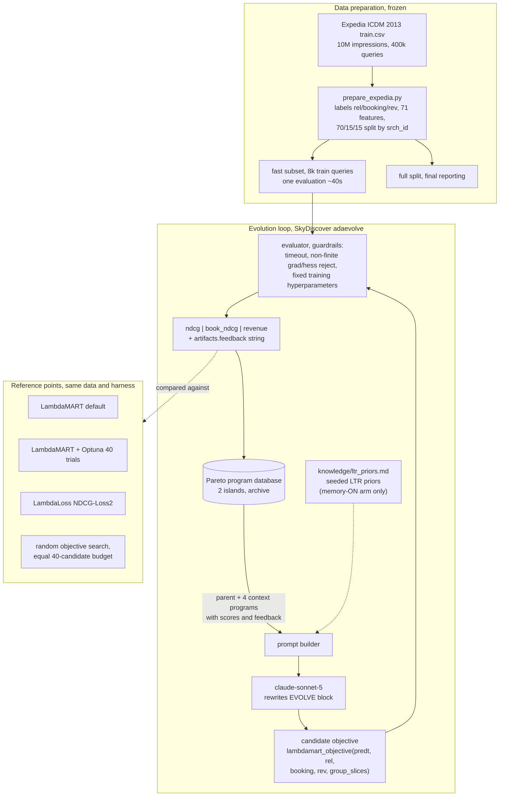

# EvoRank: approach, terminology, and work log

Working document for the short paper (target venue withheld here). Everything here is
implemented and measured unless marked PLANNED. Numbers come from
runs/summary/comparison.csv via analyze/aggregate.py, never transcribed by hand.

## 1. Problem statement

Production ranking systems optimize several competing business outcomes at
once: relevance (clicks), conversion (bookings), and revenue. The training
objective that balances them is hand-engineered, and the design space
(gain construction, pair weighting, position discounting, revenue transforms)
is explored slowly by human iteration. Meta's REA and GEARS showed that
LLM-driven agents can automate ranking experimentation, but both are closed
and DNN-based. EvoRank is the open, reproducible counterpart for the dominant
tabular-LTR stack: gradient-boosted trees trained with lambda-gradient
objectives.

Claim under test: LLM-guided evolutionary search discovers interpretable
Learning-to-Rank objectives that compete with hand-tuned losses across
relevance, conversion, and revenue on real e-commerce search data, and seeding
the search with domain knowledge measurably accelerates discovery.

## 2. System overview (implemented)

The loop is standard evolutionary program search (SkyDiscover, adaevolve
controller) around one mutable artifact: the training objective.

```
sample parent from Pareto DB -> build prompt (parent + 4 context programs
+ system message) -> LLM mutates the EVOLVE block -> guardrailed evaluation
(train XGBoost with candidate objective, fixed hyperparameters) -> three
metrics + feedback string -> Pareto archive -> repeat
```

Mermaid source for the paper figure (rendered copy in paper/figures/):



Key design decisions, each load-bearing for the claims:

1. Only the objective evolves. Data, features, training config, and metrics
   are frozen, so any metric movement is attributable to the discovered
   objective (and the post-hoc control in 4.3 closes the remaining asymmetry).
2. The objective sees raw behavioral signals per row: graded relevance rel,
   binary booking, and booking revenue rev in USD. How to weight or transform
   revenue (log, clip, per-pair) is left to the search, not hand-set.
3. Fitness is a three-objective Pareto archive, not a scalar. The three
   metrics genuinely trade off: ndcg and book_ndcg average queries equally
   while revenue pools dollars across queries, so high-value bookings dominate
   the revenue axis (single-booking-per-query data makes a per-query revenue
   NDCG collapse onto book_ndcg, measured and documented in CLAUDE.md 6).
4. Degenerate objectives can never score: non-finite gradients, wrong shapes,
   and timeouts return zero fitness with an explanatory feedback string.

## 3. Feedback channels (the treatment axes)

What the LLM learns from, per iteration:

| channel | content today | condition |
|---|---|---|
| selection | Pareto survival on the three metrics | always |
| in-context | parent + 4 archive programs with scores | always |
| artifacts.feedback | scores only | memory-OFF (minimal) |
| artifacts.feedback | scores + deltas vs seed + one-line reading | memory-ON (rich) |
| system message | generic task description | memory-OFF |
| system message | task description + curated LTR priors | memory-ON |

IMPLEMENTED (eval/diagnostics.py, EVORANK_FEEDBACK=diagnostic): an evidence
block per candidate, computed from predictions and gradients already in hand,
zero extra training and zero extra LLM calls, 3 to 6 seconds overhead:

1. Noise-gated deltas. Paired query bootstrap vs the cached seed reference;
   every delta is labeled SIGNIFICANT or within noise. Motivated by our
   measured finding that per-edit effect sizes were smaller than fitness noise
   on the original 1.6k-query fold. The fast subset was regenerated with a
   6k-query val fold (data/prepare_expedia.py --fast-only --fast-eval-queries),
   cutting metric noise roughly 2x at negligible evaluation cost, since
   candidate evaluation is dominated by training time.
2. Segment decomposition: booked vs click-only query ndcg with deltas vs
   seed, and booked-item median rank on the top-revenue-decile queries.
3. Behavior: booked-item rank distribution (median, top-1 rate, outside
   top-10), score spread (degeneracy detector), top-10 overlap with the seed
   ranking (edit churn).
4. Gradient alignment probe: one small virtual gradient step applied to the
   trained model's scores, reporting whether the candidate's own gradient
   moves each of the three metrics up or down (e.g. "ANTI-ALIGNED with
   revenue"). Detects objective-metric misalignment without any retraining.
5. Signal-usage probe: gradient recomputed with each behavioral signal zeroed;
   reports the share of gradient mass attributable to rel, booking, and rev,
   flagging functionally dead terms.

Components 4 and 5 are gradient-level introspection, possible precisely
because the evolved artifact is a differentiable training objective. Prior
reflective-evolution work (Reflexion, ProTeGi, GEPA, AlphaEvolve artifacts)
feeds back execution traces and scores; we are not aware of gradient-probe
feedback for loss-function discovery. Experimental design: 2x2 ablation,
priors {off, on} x feedback {scores-only, diagnostic}, preceded by a 1-seed
probe (runs/_configs/launch_probe.sh) as a decision gate. Motivating
observation already in hand: the manual mechanism ablation (section 4.4)
improved the best program by removing a component, demonstrating that
mechanism-level evidence beats scalar scores; diagnostic feedback gives the
loop that evidence automatically.

## 4. Experimental protocol (executed July 3, 2026)

### 4.1 Data
Expedia Personalized Hotel Search (ICDM 2013), training file only, split
70/15/15 by srch_id. Labels: rel = 5 booked / 1 clicked / 0 else, booking,
rev = gross_bookings_usd when booked. 71 numeric features, leakage columns
dropped (position, *_bool, gross_bookings_usd), comp* columns get missing
indicators. Fast subset for the loop: 8k/1.6k/1.6k queries, one candidate
evaluation 40s. Hard data gate (data/data_report.py) passed before any run.

### 4.2 Run matrix
- Baselines: LambdaMART default, LambdaMART Optuna-tuned (40 trials, the bar),
  LambdaLoss NDCG-Loss2, random objective search at the equal 40-candidate
  budget.
- Ablation: {memory-on, memory-off} x seeds {0,1,2}, 40 iterations each,
  identical configs except the system message and feedback mode (diffability
  machine-checked).
- Post-hoc control: best discovered objective granted the same Optuna budget
  as the tuned baseline (baselines/retune_best.py).

### 4.3 Results so far (fast subset, val fold, NDCG@10 family)

| method | ndcg | book_ndcg | revenue |
|---|---|---|---|
| LambdaMART + Optuna | 0.4382 | 0.4644 | 0.4233 |
| best discovered + same Optuna budget | 0.4352 | 0.4602 | 0.4088 |
| best evolved, fixed params (mem_on_s1) | 0.4325 | 0.4559 | 0.4095 |
| random search, equal budget | 0.4301 | 0.4506 | 0.4028 |
| seed objective (= rank:ndcg reimpl.) | 0.4256 | 0.4477 | 0.4060 |
| LambdaMART default | 0.4230 | 0.4474 | 0.3960 |
| LambdaLoss NDCG-Loss2 | 0.3816 | 0.3966 | 0.3480 |

Ablation: final best ndcg mean 0.4308 in BOTH conditions (on: +/-0.0018,
off: +/-0.0008). Iterations to reach the random-search-40 level: memory-on
1-3 (2 of 3 seeds), memory-off 7-23. Reading: seeded priors change the speed
of discovery, roughly 5x, not the ceiling.

Discovered objective (mem_on_s1, figure 1 candidate): clipped-log revenue
gain 3.5 * log1p(clip(rev, 3000)) / log1p(3000), i.e. the search invented its
own outlier handling, plus a per-query adaptive blend, booking queries weight
a listwise Plackett-Luce top-1 term (alpha 0.55) while click-only queries
lean on the pairwise |deltaNDCG| lambda (alpha 0.85), matching the
single-booking-per-query structure.

Honest negative: no evolved objective Pareto-dominates the tuned baseline at
this budget, including after the symmetric retune control.

### 4.4 Tier 1 analyses (July 3, afternoon)

Hypervolume (analyze/hypervolume.py, runs/summary/hypervolume.csv). On the
3-objective hypervolume of the final front, memory-on beats memory-off in all
three seeds (mean 252 vs 230, x1e-6, common reference point), and every
evolution run beats the equal-budget random search (189). The scalar
best-ndcg endpoint had hidden this: the ablation has a final-quality result on
the multi-objective endpoint, not only a speed result.

Mechanism ablation (analyze/mechanism_ablation.py,
runs/summary/mechanism_ablation.csv). Knocking out one mechanism at a time in
the best discovered program: the listwise Plackett-Luce term contributes the
most (+0.008 ndcg when present), the clipped-log revenue gain is second
(+0.005 ndcg, +0.009 revenue), the log-vs-linear transform is roughly neutral
given the clip. The per-query adaptive alpha turned out to be HARMFUL:
replacing it with a constant alpha = 0.70 improves all three metrics
(0.4353 / 0.4589 / 0.4196), making this simplified variant the best
fixed-hyperparameter program found. The ablation therefore both attributes
the gains and yields a stronger, simpler objective, which we adopt as
"evolved_simplified" in subsequent evaluation.

Statistical significance (analyze/significance.py, paired query bootstrap,
10k resamples, runs/summary/significance_fast_val.csv). On the 1.6k-query
fast val fold the per-query confidence intervals are +/-0.008 to 0.015, wider
than most observed deltas: evolved-vs-random is not individually significant
there (p about 0.5), evolved-vs-seed is marginal (p about 0.07), and parity
with the tuned baseline is supported on ndcg and book_ndcg while the tuned
evolved program is significantly worse on revenue (p about 0.03). Claims that
rest on single-fold point differences at this fold size are therefore not
defensible.

### 4.5 Transfer verdicts and the reframed story (July 4-5)

Tight-interval evaluation (fast-train / full-test-fold protocol, 60k queries,
runs/summary/significance_fasttrain_fullfold_test.csv): the evolved best does
NOT beat the seed on held-out data (+0.0002 ndcg, p=0.76); random search's
best is marginally better than the LLM's (p=0.03); every method is
significantly below tuned LambdaMART (p=0.0002). Full-split training
(runs/summary/full_eval.csv, partial): all objectives including default
rank:ndcg converge to ~0.440-0.441 at 280k training queries, so objective
choice on this dataset matters only in the limited-data regime.

Selection-generalization audit (analyze/generalization_audit.py, 12 runs,
per-checkpoint best programs scored on the selection fold and the 60k-query
test fold): the July 3 runs selected essentially nothing that transfers
(mean +5 bp test). De-noising the fitness fold (1.6k to 6k val queries, the
only difference between the mem_off and probe_scores arms) roughly tripled
mean transferred gain (+4 to +14 bp). Diagnostic feedback showed no advantage
over scores-only across 3 seeds on any endpoint (val convergence 0.4258 vs
0.4262 mean final; transfer +8 vs +14 bp), so the feedback-content axis is
reported as a measured negative; the fitness-signal-quality axis is the one
that moved outcomes.

Paper story after these verdicts: an open, fully audited case study of what
it takes to make LLM-driven objective discovery real. (1) The loop appears to
work on its selection fold while transferring nothing, and the mechanism is
measured (fitness noise exceeds per-edit effect size). (2) A zero-cost
data-side fix (larger fitness fold) is the intervention that changes transfer,
while guidance-side interventions (priors, evidence-rich diagnostics) change
search speed and selection-fold quality but not what generalizes. (3)
Gradient-level diagnosis (alignment and signal-usage probes, mechanism
ablation) explains discovered programs and improved one by simplification.
(4) At full data scale the objective family is a plateau on this benchmark.
Decisions: full 2x2, phase-alternated HPO, combination stage, and MSLR
transfer are dropped (see runs/summary/MORNING_SUMMARY_JUL5.md section 3);
the optional remaining experiment is a long-horizon (T=100) run pair on the
de-noised fold.

## 5. Planned extensions (terminology glossary)

These are the short names used in project discussion, with their meaning and
their proposed paper naming.

### A1, phase-alternated HPO ("alternating structural-numeric optimization")
Motivation: an LLM is the right tool for structural search (code, mechanisms)
and a poor, expensive tool for continuous numeric search; TPE is the reverse.
Method: coordinate-descent style alternation. Phase 1, evolve the objective at
fixed training hyperparameters. Phase 2, freeze the best objective and tune
hyperparameters with Optuna TPE (30 trials, CPU only). Phase 3, evolve again
seeded with the phase-1 winner under the tuned configuration, so structure can
exploit the new config. Finish by retuning every program on the final Pareto
front, not only the ndcg-best. Zero additional LLM cost relative to a plain
longer run; each evolution phase is internally consistent (one config per
phase), so archive scores stay comparable.

### B, combination stage ("cross-population combination phase")
Motivation: REA's pipeline is validation -> combination -> exploitation; the
combination step, merging mechanisms from independent experiments, is where
it reports novel wins. Our six ablation runs converged to different
mechanisms (revenue-heavy, listwise-heavy, ndcg-conservative). Method: prompt
the LLM with the Pareto leaders of all completed runs and ask for merged
candidates (about 10-15 calls), then run a short exploitation phase on the
best merges. Evolutionary crossover across populations rather than within one.

### C, MSLR transfer ("zero-shot objective transfer")
Motivation: the strongest evidence that a discovered objective is a reusable
method, not a dataset artifact, is dropping it unchanged onto a standard
benchmark. Method: train XGBoost on MSLR-WEB30K (public benchmark, numeric
features, graded relevance) with the discovered objective versus rank:ndcg,
no adaptation beyond the label mapping. Reported as a portability result.

### Diagnostic feedback (section 3, PLANNED)
The 2x2 feedback ablation described above; the second contribution axis if
Pareto domination remains out of reach.

## 6. Figure plan for the 5-page paper

1. Figure 1: system flowchart (mermaid above, redrawn) plus the discovered
   objective snippet with mechanism annotations.
2. Figure 2: three-objective scatter (frontier CSVs), evolved programs vs
   baselines, one marker family per method.
3. Figure 3: memory ablation convergence, best-so-far ndcg vs iteration,
   3 seeds per condition with the random-search-40 level as a horizontal
   reference line (data: runs/summary/convergence_*.csv).
4. Table 1: the results table in 4.3, extended with full-split numbers.

## 7. Reproducibility inventory

Configs (configs/, runs/_configs/ per-seed copies), seeds, per-iteration
metrics (runs/*/adaevolve_iteration_stats_*.jsonl), checkpoints with full
program sources every 5 iterations, run records for every baseline
(runs/*.json), aggregation script (analyze/aggregate.py), knowledge base
version-pinned (knowledge/ltr_priors.md). Loop model claude-sonnet-5, one
LLM call per iteration, ~290 calls total for everything above.
